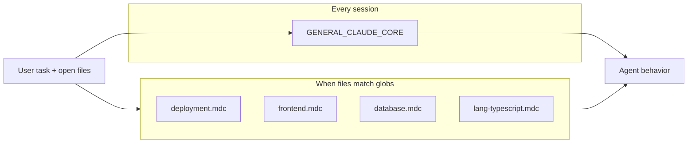

# Rules Split Architecture

How to split `GENERAL_CLAUDE.md` (or `CLAUDE.md`) into **always-on** core rules and **scoped** Cursor rules for better adherence without losing authority.

## Problem

The full rules files (~1,200–1,800 lines) fit in context but compete with code, diffs, and chat history. Models follow Prime Directives reliably; distant sections (documentation, design tokens, CI templates) drift unless the task touches them.

## Strategy

| Layer | Role | Target size |
|-------|------|-------------|
| **Core (always-on)** | Non-negotiable behavior on every turn | ~350–500 lines |
| **Scoped (`.cursor/rules/*.mdc`)** | Deep rules loaded when relevant files are in context | ~50–150 lines each |
| **Full reference** | `GENERAL_CLAUDE.md` / `CLAUDE.md` remain source of truth; scoped rules link back | unchanged |

On conflict: **Core > scoped rule > full reference examples**. Corrections still append to the active file's Correction Log.

---

## Always-on: `GENERAL_CLAUDE_CORE.md` (or one `.mdc` with `alwaysApply: true`)

Keep these sections **verbatim or tightly summarized**. This is what loads every session.

| Section | In core? | Notes |
|---------|----------|-------|
| Header + authority block | Yes | Full |
| Prime Directives | Yes | Full — all 6 |
| Table of Contents | Yes | List sections + pointer to `.cursor/rules/` |
| Clarification Protocol | Yes | Full trigger table + warning format |
| Correction & Memory Protocol | Yes | Full 7-step + entry format |
| Deployment Configuration Protocol | **Abbreviated** | 12-step checklist titles + STOP conditions only; link to `deployment.mdc` for detail |
| Runtime Model | Yes | Full, including Project Discovery Protocol |
| Project Structure | **Summary** | Discovery protocol + "never deviate"; drop archetype templates |
| Architecture Rules | Yes | Full dependency direction + layer responsibilities |
| Code Quality | Yes | Limits, commits, PR checklist |
| Enforcement Summary | Yes | Full table |
| Correction Log | Yes | Append-only; stays in core file |

**Do not put in always-on:** long examples, YAML templates, per-language blocks, default color hex lists, CI workflow samples.

### Abbreviated deployment block (example for core)

```markdown
## DEPLOYMENT — MANDATORY CHECKLIST (detail: .cursor/rules/deployment.mdc)

Before ANY deploy: complete Steps 1–12 in order. STOP on missing env, hardcoded secrets,
or unknown mechanism. Discover commands from README/RUNBOOK/manifests — never assume.

1. Env/config populated
2. Deployment manifest valid
3. Build artifacts exist
4. Health checks defined
5. Network/connectivity correct
6. No hardcoded secrets
7. Pinned versions
8. Least-privilege runtime
9. Run project-documented deploy command
10. Run migrations in runtime context
11. Verify post-deploy health
12. Report status to user

Rules D-01 through D-08 apply. Destructive teardown requires explicit user confirmation.
```

Estimated core size: **~400 lines** including Correction Log.

---

## Scoped rules: `.cursor/rules/`

Create `.mdc` files with YAML frontmatter. Use `alwaysApply: false` and `globs` unless noted.

### 1. `deployment.mdc`

```yaml
description: Full 12-step deployment protocol, D-01–D-08, manifest discovery, command examples
globs: "**/docker-compose*.yml,**/compose.yaml,**/Makefile,**/Taskfile.yml,**/.github/workflows/deploy*.yml,**/terraform/**,**/k8s/**,**/helm/**,**/RUNBOOK.md"
alwaysApply: false
```

**Content:** Full `DEPLOYMENT CONFIGURATION PROTOCOL` from `GENERAL_CLAUDE.md` (discovery tables, steps 1–12 expanded, D-01–D-08, example commands labeled EXAMPLES ONLY).

---

### 2. `auth-security.mdc`

```yaml
description: Authentication, sessions, MFA, passwords, RBAC, rate limiting
globs: "**/auth/**,**/middleware/authenticate*,**/middleware/authorize*,**/security/**,**/*auth*.*"
alwaysApply: false
```

**Content:** Sections 8–9, 11–12 (Authentication & Security, RBAC, Input Security, Rate Limiting). Omit if project has no auth unless task is auth-related (agent uses Clarification Protocol).

---

### 3. `security-headers.mdc`

```yaml
description: HTTP security headers (CSP, HSTS, frame options)
globs: "**/middleware/**,**/nginx*.conf,**/Caddyfile,**/app.ts,**/main.go,**/settings.py"
alwaysApply: false
```

**Content:** Section 10 (Security Headers). Small; can merge into `auth-security.mdc` if preferred.

---

### 4. `api-design.mdc`

```yaml
description: API versioning, response envelopes, error format, auth endpoint capabilities
globs: "**/routes/**,**/controllers/**,**/handlers/**,**/api/**,**/openapi.*,**/swagger.*"
alwaysApply: false
```

**Content:** Section 17 (API Design Rules).

---

### 5. `database.mdc`

```yaml
description: Schema rules, queries, migrations, pagination, soft delete
globs: "**/migrations/**,**/prisma/**,**/alembic/**,**/db/**,**/models/**,**/schema.*,**/*migration*"
alwaysApply: false
```

**Content:** Section 16 (Database Rules).

---

### 6. `frontend.mdc`

```yaml
description: UI components, forms, a11y, loading states, routing guards
globs: "**/*.tsx,**/*.jsx,**/*.vue,**/*.svelte,**/components/**,**/features/**,**/pages/**"
alwaysApply: false
```

**Content:** Sections 5 + 18 (Design System & Color Tokens, Frontend Rules). Include default token scaffold only when project has no design system.

---

### 7. `design-tokens.mdc` (optional split from frontend)

```yaml
description: Color tokens, typography, spacing — no hardcoded values in components
globs: "**/tailwind.config.*,**/globals.css,**/theme.*,**/tokens.*,**/*.css"
alwaysApply: false
```

**Content:** Color/typography tables from Section 5. Skip if `frontend.mdc` is enough.

---

### 8. `containers-infra.mdc`

```yaml
description: Docker, Compose, K8s, Terraform — multi-stage, non-root, pinned images
globs: "**/Dockerfile*,**/docker-compose*.yml,**/compose.yaml,**/k8s/**,**/helm/**,**/*.tf"
alwaysApply: false
```

**Content:** Section 19 (Container & Infrastructure Rules).

---

### 9. `testing.mdc`

```yaml
description: Test pyramid, coverage thresholds, security tests
globs: "**/*.test.*,**/*.spec.*,**/*_test.*,**/tests/**,**/__tests__/**,**/jest.config.*,**/pytest.ini"
alwaysApply: false
```

**Content:** Section 20 (Testing Rules).

---

### 10. `ci-cd.mdc`

```yaml
description: CI jobs, security scan, deploy workflow patterns
globs: "**/.github/workflows/**,**/.gitlab-ci.yml,**/Jenkinsfile,**/azure-pipelines.yml"
alwaysApply: false
```

**Content:** Section 21 (CI/CD). Reference templates only.

---

### 11. `environment.mdc`

```yaml
description: Env validation, .env.example sync, 12-factor config
globs: "**/.env.example,**/config/env.*,**/settings.py,**/config.ts,**/*env*schema*"
alwaysApply: false
```

**Content:** Section 22 (Environment Variables).

---

### 12. `optional-modules.mdc`

```yaml
description: Optional integrations — lazy load, health probes, no import-time failures
globs: "**/modules/**,**/integrations/**,**/register*module*,**/plugin/**"
alwaysApply: false
```

**Content:** Section 14 (Optional Modules).

---

### 13. `documentation.mdc`

```yaml
description: Mandatory docs, sync policy, comments, PR doc checklist
alwaysApply: false
```

**Note:** No file glob reliably signals "user is editing docs." Options:

- `globs: "**/README.md,**/CHANGELOG.md,**/ARCHITECTURE.md,**/API_REFERENCE.md,**/RUNBOOK.md,**/USER_GUIDE.md"`
- Or `alwaysApply: true` with **short** checklist only (~40 lines) in core and full rules here

**Content:** Section 24 (Documentation Rules).

---

### 14. `security-checklist.mdc`

```yaml
description: Pre-release security checklist — auth, API, infrastructure
globs: "**/CHANGELOG.md,**/RELEASE*,**/.github/workflows/release*"
alwaysApply: false
```

**Content:** Section 25 (Security Checklist). Often used at release time; short version can live in core PR checklist.

---

### 15. Language rules (one file per language detected in repo)

| File | Globs | Content |
|------|-------|---------|
| `lang-typescript.mdc` | `**/*.{ts,tsx}` | TypeScript subsection from Section 15 |
| `lang-python.mdc` | `**/*.py` | Python subsection from Section 15 |
| `lang-go.mdc` | `**/*.go` | Go subsection from Section 15 |
| `lang-rust.mdc` | `**/*.rs` | Rust subsection from Section 15 |
| `lang-java.mdc` | `**/*.{java,kt}` | Java/Kotlin subsection from Section 15 |

**Content:** Only the relevant block from Section 15 (Language & Type Safety Rules), plus universal forbidden/required patterns.

---

## `CLAUDE.md` stack-specific split

Same pattern; swap scoped content for Node monorepo paths.

| Scoped file | Globs | Replaces |
|-------------|-------|----------|
| `nodejs-deployment.mdc` | `docker-compose*.yml`, `apps/api/Dockerfile`, `apps/web/Dockerfile` | Full Compose + 12-step with compose commands |
| `nodejs-api.mdc` | `apps/api/**` | Express modules, Prisma, Zod, middleware names |
| `nodejs-web.mdc` | `apps/web/**` | React, Vite, Tailwind, shadcn, axios patterns |
| `prisma-database.mdc` | `apps/api/prisma/**` | Full Prisma schema + migration rules |

Always-on core for Node projects can point to `CLAUDE.md` Correction Log and abbreviated checklist; deep YAML/templates live in scoped files only.

---

## Loading behavior (how this helps)



| Task | What loads |
|------|------------|
| "Fix typo in README" | Core only |
| "Add login endpoint" | Core + `api-design.mdc` + `auth-security.mdc` + `lang-*.mdc` |
| "Style the dashboard" | Core + `frontend.mdc` + `design-tokens.mdc` |
| "Deploy to staging" | Core (abbrev checklist) + `deployment.mdc` + `containers-infra.mdc` |
| "Add migration" | Core + `database.mdc` + `lang-*.mdc` |

---

## File layout (recommended)

```
claude/
├── GENERAL_CLAUDE.md          # Full reference (unchanged authority)
├── GENERAL_CLAUDE_CORE.md     # Slim always-on — IMPLEMENTED
├── CLAUDE.md                  # Full Node stack reference
├── RULES_SPLIT.md             # This document
├── README.md
└── .cursor/
    └── rules/                 # IMPLEMENTED — 20 scoped rules + core.mdc
        ├── core.mdc             # alwaysApply: true
        ├── deployment.mdc
        ├── auth-security.mdc
        ├── security-headers.mdc
        ├── api-design.mdc
        ├── database.mdc
        ├── frontend.mdc
        ├── design-tokens.mdc
        ├── containers-infra.mdc
        ├── testing.mdc
        ├── ci-cd.mdc
        ├── environment.mdc
        ├── optional-modules.mdc
        ├── documentation.mdc
        ├── security-checklist.mdc
        ├── lang-typescript.mdc
        ├── lang-python.mdc
        ├── lang-go.mdc
        ├── lang-rust.mdc
        └── lang-java.mdc
```

### `core.mdc` (alwaysApply: true)

```yaml
---
description: Prime directives, clarification, correction protocol, architecture, code quality
alwaysApply: true
---

# Core rules

Follow GENERAL_CLAUDE_CORE.md (or embedded content).
Full reference: GENERAL_CLAUDE.md. Scoped detail: sibling rules in .cursor/rules/.
```

Either embed core content directly in `core.mdc` or keep `GENERAL_CLAUDE_CORE.md` at repo root and reference it.

---

## Migration steps

1. Create `GENERAL_CLAUDE_CORE.md` by copying sections listed in "Always-on" above.
2. Extract each scoped section into `.cursor/rules/*.mdc` with frontmatter.
3. Add to core TOC: "Sections 5–25: see `.cursor/rules/` when applicable."
4. Update `README.md` with split architecture link.
5. In target projects: copy `GENERAL_CLAUDE_CORE.md` + `.cursor/rules/` (or symlink from this repo).
6. Keep `GENERAL_CLAUDE.md` as the merge target when editing rules; regenerate core + scoped from it periodically.

---

## What not to split

| Keep unified | Reason |
|--------------|--------|
| Prime Directives | Must override everything; never gated |
| Clarification Protocol | Must trigger even when no files open |
| Correction & Memory | Corrections must apply globally |
| Correction Log | Single append-only audit trail |
| Enforcement Summary | Authority levels apply to all sections |

---

## Expected improvement

| Metric | Full file always-on | Split |
|--------|---------------------|-------|
| Always-on tokens | ~15k–25k | ~4k–6k |
| Deploy checklist adherence | Medium | High when compose/CI files in context |
| UI token compliance | Low on backend tasks | High when editing components |
| Rule contradictions | Rare if single file | Prevent with "core wins" hierarchy |

---

## Quick decision: which file for a project?

| Project | Always-on | Scoped pack |
|---------|-----------|-------------|
| Generic / polyglot | `GENERAL_CLAUDE_CORE.md` | `general/*.mdc` |
| Node fullstack monorepo | `CLAUDE_CORE.md` | `nodejs/*.mdc` |
| Library only | `GENERAL_CLAUDE_CORE.md` | `lang-*.mdc` + `testing.mdc` only |

Copy only the scoped rules that match the repo's languages and archetype.
